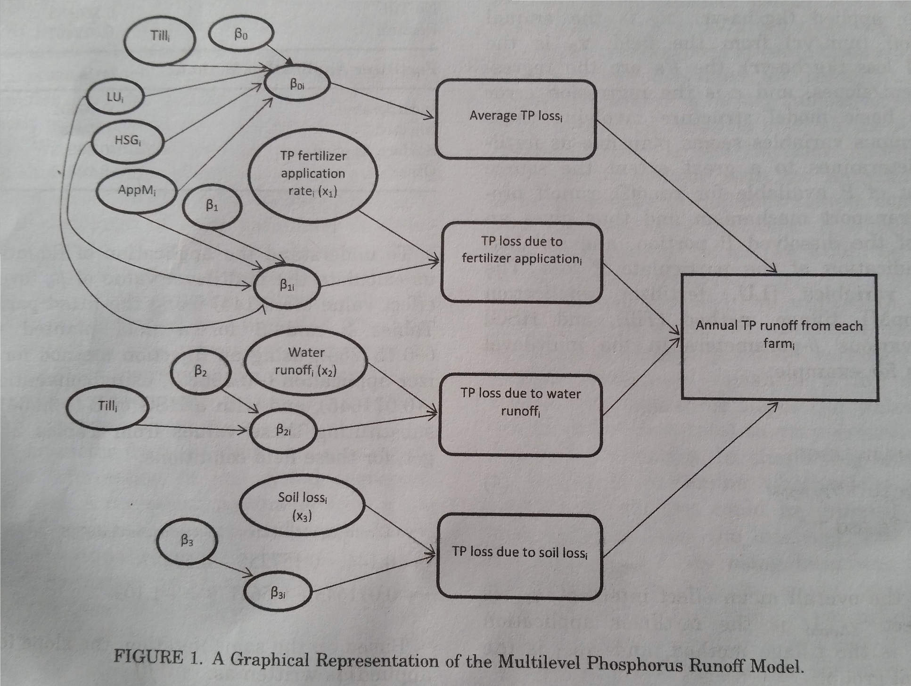

<style>
  .col2 {
    columns: 2 200px;         /* number of columns and width in pixels*/
    -webkit-columns: 2 200px; /* chrome, safari */
    -moz-columns: 2 200px;    /* firefox */
  }
  .col3 {
    columns: 3 100px;
    -webkit-columns: 3 100px;
    -moz-columns: 3 100px;
  }
</style>

## Introduction

[Reckhow et al. (2009)](http://onlinelibrary.wiley.com/doi/10.1111/j.1752-1688.2008.00298.x/abstract) developed a hierarchical model to predict phosphorus run-off from farms that apply commercial (inorganic) fertilizers and animal manures.  The model's intent is to inform the development of Best Management Practices and to provide empirical augmentation to watershed-scale models.  With this interactive version of their model a farm manager can input information about their fields to predict their expected impact and explore alternative crops or management practices.

*Reckhow KH, Qian SS, Harmel RD (2009) A multilevel model of the impact of farm-level best management practices on phosphorus runoff.  Journal of the American Water Resources Association 45(2):369-377*

## Statistical Background

Data for the model include information related to annual nutrient loads, soil characteristics, and farm management practices. The data were extracted from MANAGE (current version available [online](http://www.ars.usda.gov/Research/docs.htm?docid=11079)), a database which includes measurements of phosphorus loading, plus a number of candidate predictor variables, from 55 studies ([Harmel et al. 2008](http://www.ncbi.nlm.nih.gov/pubmed/18948496)).  Of these candidate predictor variables, three emerged as key variabes during exploratory analysis: water runoff, soil loss, and phospherus (fertilizer) application rates.  Exploratory analyses also demonstrated these regression parameters varied dependent upon land use (crop type), hydrologic soil group, fertilizer application method, tillage method, and conservation practice.  A sixth categorical variable, site, was considered but rejected as confounded with land use and soil group.

Reckhow et al. fit their models with the maximum likelihood estimator for multilevel models implemented in the R function Linear Mixed-Effects Models ([lmer](http://www.inside-r.org/packages/cran/lme4/docs/lmer)). In the simplest terms, the advantage of multilevel (aka hierarchichal) modeling approaches is the ability to leverage group membership by pooling like samples based on categorical variables. 

 - No pooling: Every site is unique and therefore has a unique set of parameter estimates for the predictor variables and the development of the model for each site is entirely independent of the models at other sites.
 - Complete pooling: The model assumes all studies share the same global parameter etsimates and standard errors.
 - Partial pooling: A compromise between the previous two extremes in which the parameter values are adjusted ("shrinkage") based on the ratio of within and between group variances.

The original article provides further explanation of this statistical approach and the source data.
 
Overall, the model with the best fit and physical interpretation for predicting phosphorus loading from agriculture was:

$$log(PL_{i}) = \beta_{0,LU[i],AppM[i],Till[i],HSG[i]} + \beta_{1,LU[i],AppM[i],HSG[i]}log(x_{1i})$$
$$+ \beta_{2,Till[i]}log(x_{2i}) + \beta_{3}log(x_{3i}) + \epsilon$$

Where: 

 - $PL_{i}$, annual total phosphorus runoff (kg/ha-yr) from study site i
 - $x_{1}$, annual amount of fertilizer applied (kg/ha-yr)
 - $x_{2}$, annual water runoff (mm/yr) from the field
 - $x_{3}$, annual soil loss (kg/ha-yr)
 - $\beta$ values, the regression intercept and slopes
 - $\epsilon$, error term
 - *LU*, land use or crop type
 - *AppM*, fertilizer application method
 - *Till*, tillage method
 - *HSG*, hydrologic soil group

The categorical variables (*LU, AppM, Till*, and *HSG*) determine the various beta parameters in the multilevel model.  For example:

$$\beta_{0,LU[i],AppM[i],Till[i],HSG[i]} = \mu_{\beta0} + \gamma_{\beta0,LU} + \gamma_{\beta0,AppM}$$
$$+ \gamma_{\beta0,Till} + \gamma_{\beta0,HSG} + \epsilon$$

where $\mu_{\beta0}$ is the overall mean effect intercept.

As previously mentioned, the data to define these relationships and estimate parameters within the published models came from the MANAGE database.

The structure of the model as illustrated in Reckhow et al. (Figure 1, pg. 374).




## Data Preparation

I entered the estimates for overall mean (Table 2, pg. 373) and categorical variable (Table 3, pg 373) effects calculated by Reckhow et al. into two csv spreadsheets.

####OverallMeanEffects.csv
```{r, echo = FALSE}
#setwd("E:/P_Consulting/Proposals-Dev/Reckhow/Reckhowetal2009/")
overall <- read.csv("OverallMeanEffects.csv")
overall
```

####CatVarEffects.csv
```{r, echo = FALSE}
cats <- read.csv("CatVarEffects.csv")
cats
```


## Predict Phosphorus Runoff

Enter the current and alternative characteristics of your field and management practices to see the predicted annual phosphorus runoff amount.

<div class="col2">
```{r fieldONE, echo = FALSE, fig.width=4}
h4("CURRENT SCENARIO")

sliderInput("fert1", "Amount of Fertilizer Applied:", min = 0, max = 30, value = 13.812)
sliderInput("water1", "Water Runoff:", min = 10, max = 100, value = 57.439)
sliderInput("soil1", "Amount of Soil Loss:", min = 250, max = 1000, value = 679.776)

selectInput("crop1", "Land Use (Crop Type):", 
            c("Alfalfa"= "Alfalfa",
              "Corn"="Corn",
              "Cotton"="Cotton", 
              "Fallow"="Fallow",
              "Oats/Wheat"="Oats/Wheat",
              "Pasture/Range"="Pasture/Range",
              "Peanuts"="Peanuts",
              "Rotation"="Rotation",
              "Sorghum"="Sorghum"))
selectInput("hsg1", "Hydrologic Soil Group:", 
            c("B"="B",
              "B and C"="B and C",
              "B and D"="B and D",
              "C"="C",
              "C/D"="C/D",
              "D"="D"))
selectInput("tillage1", "Tillage Methods", 
            c("Conservation"="Conservation",
              "Conventional"="Conventional",
              "No-Till"="No-Till",
              "Pasture"="Pasture"))
selectInput("method1", "Fertilizer Application Method", 
            c("Incorporated"="Incorporated",
              "Injected"="Injected", 
              "Surface Applied"="Surface Applied",
              "Other"="Other"))


renderText({

    LU_i <- cats[cats$Category==input$crop1,3:4]
    AppM_i <- cats[cats$Category==input$method1,3:4]
    Till_i <- cats[cats$Category==input$tillage1,c(3,5)]
    HSG_i <- cats[cats$Category==input$hsg1,3:4]
    
    mu_b0 <- overall[overall$Beta=="b0",2]
    mu_b1 <- overall[overall$Beta=="b1",2]
    mu_b2 <- overall[overall$Beta=="b2",2]
    mu_b3 <- overall[overall$Beta=="b3",2]
    
    #Average TP Loss
    ATPL <- mu_b0 + LU_i$Beta0 + AppM_i$Beta0 + Till_i$Beta0 + HSG_i$Beta0
    
    #TP Loss due to fertilizer application
    TPLFA <- (mu_b1 + LU_i$Beta1 + AppM_i$Beta1 + HSG_i$Beta1)*log(input$fert1)

    #TP Loss due to water runoff
    TPLWR <- (mu_b2 + Till_i$Beta2)*log(input$water1)
    
    #TP Loss due to soil loss
    TPLSL <- mu_b3*log(input$soil1)
    
    LogTotalP <<- ATPL + TPLFA + TPLWR + TPLSL

    WatershedTP <- paste0("Based on the values that you have selected, the expected annual total phosphorus (TP) runoff is ",
                          round(exp(LogTotalP),2), " kg/ha-yr.")
    

})

```

```{r fieldTWO, echo = FALSE, fig.width=4}

h4("ALTERNATIVE SCENARIO")

sliderInput("fert2", "Amount of Fertilizer Applied:", min = 0, max = 30, value = 13.812)
sliderInput("water2", "Water Runoff:", min = 10, max = 100, value = 57.439)
sliderInput("soil2", "Amount of Soil Loss:", min = 250, max = 1000, value = 679.776)

selectInput("crop2", "Land Use (Crop Type):", 
            c("Alfalfa"= "Alfalfa",
              "Corn"="Corn",
              "Cotton"="Cotton", 
              "Fallow"="Fallow",
              "Oats/Wheat"="Oats/Wheat",
              "Pasture/Range"="Pasture/Range",
              "Peanuts"="Peanuts",
              "Rotation"="Rotation",
              "Sorghum"="Sorghum"))
selectInput("hsg2", "Hydrologic Soil Group:", 
            c("B"="B",
              "B and C"="B and C",
              "B and D"="B and D",
              "C"="C",
              "C/D"="C/D",
              "D"="D"))
selectInput("tillage2", "Tillage Methods", 
            c("Conservation"="Conservation",
              "Conventional"="Conventional",
              "No-Till"="No-Till",
              "Pasture"="Pasture"))
selectInput("method2", "Fertilizer Application Method", 
            c("Incorporated"="Incorporated",
              "Injected"="Injected", 
              "Surface Applied"="Surface Applied",
              "Other"="Other"))


renderText({

    LU_i <- cats[cats$Category==input$crop2,3:4]
    AppM_i <- cats[cats$Category==input$method2,3:4]
    Till_i <- cats[cats$Category==input$tillage2,c(3,5)]
    HSG_i <- cats[cats$Category==input$hsg2,3:4]
    
    mu_b0 <- overall[overall$Beta=="b0",2]
    mu_b1 <- overall[overall$Beta=="b1",2]
    mu_b2 <- overall[overall$Beta=="b2",2]
    mu_b3 <- overall[overall$Beta=="b3",2]
    
    #Average TP Loss
    ATPL <- mu_b0 + LU_i$Beta0 + AppM_i$Beta0 + Till_i$Beta0 + HSG_i$Beta0
    
    #TP Loss due to fertilizer application
    TPLFA <- (mu_b1 + LU_i$Beta1 + AppM_i$Beta1 + HSG_i$Beta1)*log(input$fert2)

    #TP Loss due to water runoff
    TPLWR <- (mu_b2 + Till_i$Beta2)*log(input$water2)
    
    #TP Loss due to soil loss
    TPLSL <- mu_b3*log(input$soil2)
    
    LogTotalP <<- ATPL + TPLFA + TPLWR + TPLSL

    WatershedTP <- paste0("Based on the values that you have selected, the expected annual total phosphorus (TP) runoff is ",
                          round(exp(LogTotalP),2), " kg/ha-yr.")

})

```
</div>
***

## Summary

As context for the scenarios you have entered: The lowest possible phosphorus runoff value obtainable with this model is **8.55 kg/ha-yr** obtained growing sorghum on B soils and using injection fertilizer application and conservation tillage methods.  The highest possible phosphorus runoff value is **11058.92 kg/ha-yr** obtained growing oats/wheat on C soils and using incorporated fertilizer application and no-till tillage methods.

Reckhow et al. provide a full analysis of the parameters, explaining their relationships to one another and recommending possible best management practices.  According to their analysis, the effect of fertilizer application rate is a function of the application method, hydrologic soil group, and the land use (crop).  Overall, injection application methods are the most effective strategy to control fertilizer loss.

## Next Steps

This script applies the data and equations from Reckhow et al 2009 within an interactive R Markdown document.  This first draft version is very simple; it does not incorporate uncertainty or consider how the effect of the decisions on many fields could have cumulative effects at landscape scales.  Therefore, possible next steps to expand ths model would be to:

(1) Add in the standard error estimates for all intercept and slope terms and simulate expected values to report confidence bounds on predicted values.

(2) Pull data from SURRGO, CropScape, and other USDA databases to predict or hindcast changes in phosphorus runoff for watersheds containing many farms with diverse crop and soil types.

(4) Based on SE and confidence bounds, explore effect size and assurance metrics to design a sampling strategy to measure differences in phosphorus amounts between two watersheds and/or BMP scenarios.

#### For more information:

 - about the original model and associated water quality research and consulting services, contact [Dr. Ken Reckhow](https://www.linkedin.com/in/kenreckhow).
 - about this R script and associated data support consulting services, contact [Dr. Ashton Drew](https://www.linkedin.com/in/ashtondrew).

